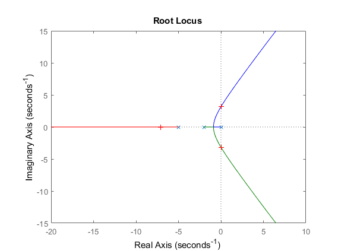
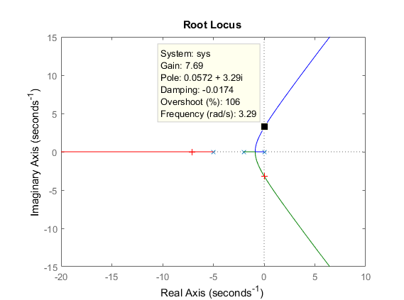

# PID Control Design

Proportional–integral–derivative (PID) control desgin using Ziegler-Nichols methodology and MATLAB control system toolbox.

Ziegler-Nichols methodology is based on the gain margin for a proportional controller. 
The gain causes the system to oscillate will be called Km, and the frequency wm [rad/s].

PID controller project file uses the Root-Locus method to select a point in the graphics window.

Use the Data Cursor to check the frequency (rad/s) after selecting the point where Real Axis is zero.

Ziegler-Nichols method is used as a starting point to find the final values of the PID controller.
Nevertheless, it shows how to design a PID controller step-by-step and it can be used for professors and/or control theory students.

For faster projects use the MATLAB control system toolbox.
